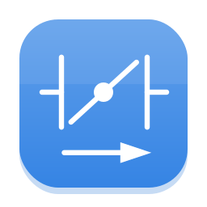
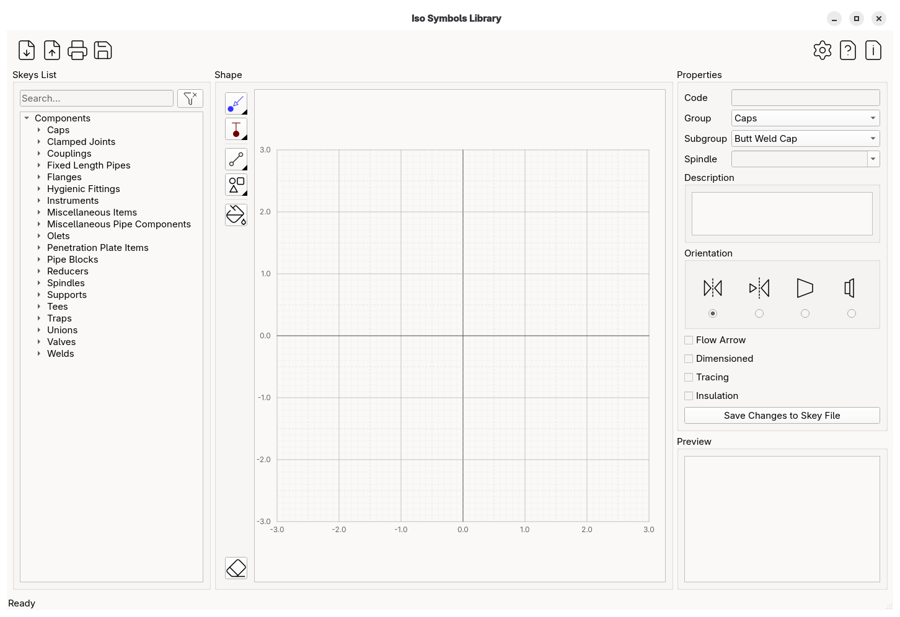
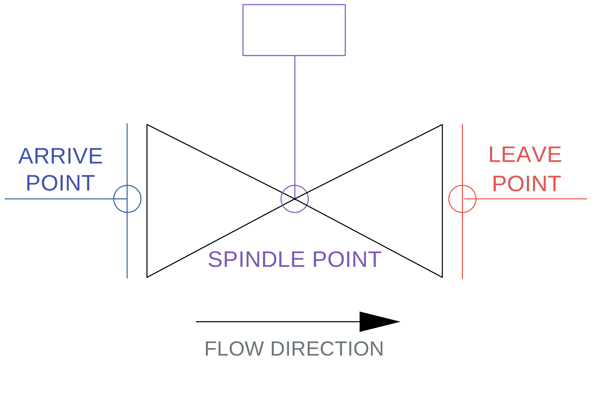

<h1 align="center">
  
  <br>
  OpenIso
</h1>

<p align="center"><em>Lightweight Isometric Piping Symbol Editor</em></p>

---

<p align="center">
  <a href="https://crowdin.com"></a>
  <a href="https://github.com/rompik/OpenIso/releases"></a>
  <a href="https://www.linux.org/"></a>
  <a href="https://www.microsoft.com/windows/"></a>
  <a href="https://opensource.org/licenses/MIT"></a>
</p>

---

<p align="center">
  
</p>


**OpenIso** is a lightweight, open-source graphical editor designed for creating and managing piping isometric fitting symbols. It bridges the gap between manual sketching and complex CAD suites, providing a streamlined environment for designing **Symbol Keys (Skeys)** and component graphics used in industrial piping software like AVEVA PDMS/E3D or Intergraph Smart 3D.

## Features

* **Format Interoperability:** Import and view symbols from **ASCII (Intergraph)** and **IDF (AVEVA)** files.
* **Precision Connectors:** Define critical piping points: `Arrive`, `Leave`, `Tee`, and `Spindle`.
* **Vector Toolset:** Specialized primitives for skeys:
    * Lines, Rectangles, Rhombus, Circle, Ellipses, Triangles, Caps (Arcs), Hexagons.
    * Hatching and Solid Color Fills.
* **Modern Export:** Save symbols in **ASCII** format for integration with modern piping tools.
* **Globalized:** Full localization support via Crowdin.

---

## Supported Symbol Keys (Skeys)

**OpenIso** allows you to define and edit standard SKEY types used in isometric generation:

| Category | Skey Examples | Description |
| :--- | :--- | :--- |
| **Valves** | `VAVW`, `VAGL`, `VACK` | Gate, Globe, and Check valves |
| **Fittings** | `ELBW`, `TEBW`, `REDC` | Elbows, Tees, and Concentric Reducers |
| **Supports** | `HNGR`, `GUID`, `STOP` | Pipe hangers and supports |
| **Instruments** | `INST`, `FLME` | Inline instruments and Flow meters |
| **Special** | `CAPW`, `FLRF` | Caps and Raised Face Flanges |

---

## Symbol Anatomy

**OpenIso** focuses on the logical structure of a piping component. Each symbol is defined by its geometry and functional connection points.

<p align="center">
  
</p>

* **Arrive & Leave:** Define the primary flow path through the component.
* **Spindle:** The orientation point for valve handles or actuators.
* **Tee:** (Not shown) Used for branching components.

---

## Installation
### Clone repository:
```bash
git clone https://github.com/rompik/OpenIso.git
cd OpenIso
```

### Install dependencies:

**OpenIso** requires Python 3.10 or higher and the following Python modules:

* **PyQt6** (≥6.0.0) – Qt bindings for the graphical user interface

* **markdown** (≥3.0.0) – Markdown parser for documentation rendering

* **pyinstaller** (≥5.0.0) – Package Python applications into standalone executables

```bash
pip install -r requirements.txt
```

### Run from the source:
```bash
python -m openiso
```

## Building Standalone Executable

To build a standalone executable,
```bash
pyinstaller --clean OpenIso.spec --onefile
```

---
## Documentation
[:uk: English](./docs/en/INDEX.MD) - Complete guide to using OpenIso, installation instructions, tutorials, and more.

