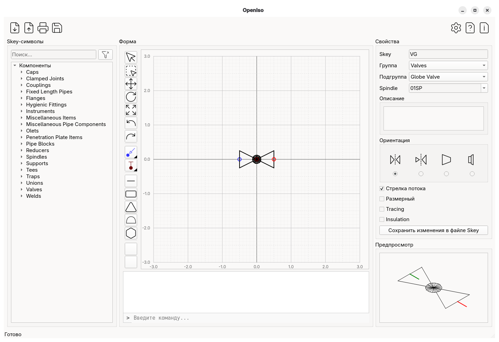
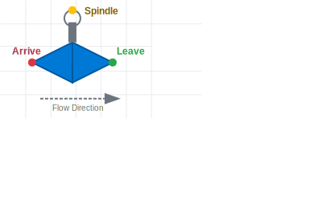

<p align="center">OpenIso ([](https://github.com/rompik/OpenIso/blob/main/docs/ru/README.md))</a>

</p>

[](https://crowdin.com)
[](https://github.com/rompik/OpenIso/releases)
[](https://www.linux.org/)
[](https://www.microsoft.com/windows/)
[](https://opensource.org/licenses/MIT)


<p align="center">
  
</p>


**OpenIso** is a lightweight, open-source graphical editor designed for creating and managing piping isometric fitting symbols. It bridges the gap between manual sketching and complex CAD suites, providing a streamlined environment for designing **Symbol Keys (SKEYs)** and component graphics used in industrial piping software like AVEVA PDMS/E3D or Intergraph Smart 3D.

## Features

* **Format Interoperability:** Import and view symbols from legacy **ASCII (Intergraph)** and **IDF (AVEVA)** files.
* **Precision Connectors:** Define critical piping points: `Arrive`, `Leave`, `Tee`, and `Spindle`.
* **Vector Toolset:** Specialized primitives for skeys:
    * Lines, Rectangles, Rhombus, Circle, Ellipses, Triangles, Caps (Arcs), Hexagons.
    * Hatching and Solid Color Fills.
* **Modern Export:** Save symbols in **ASCII** format for integration with modern piping tools.
* **Globalized:** Full localization support via Crowdin.

---

## Supported Symbol Keys (SKEYs)

OpenIso allows you to define and edit standard SKEY types used in isometric generation:

| Category | SKEY Examples | Description |
| :--- | :--- | :--- |
| **Valves** | `VAVW`, `VAGL`, `VACK` | Gate, Globe, and Check valves |
| **Fittings** | `ELBW`, `TEBW`, `REDC` | Elbows, Tees, and Concentric Reducers |
| **Supports** | `HNGR`, `GUID`, `STOP` | Pipe hangers and supports |
| **Instruments** | `INST`, `FLME` | Inline instruments and Flow meters |
| **Special** | `CAPW`, `FLRF` | Caps and Raised Face Flanges |

---

## Symbol Anatomy

OpenIso focuses on the logical structure of a piping component. Each symbol is defined by its geometry and functional connection points.

<p align="center">
  
</p>

* **Arrive & Leave:** Define the primary flow path through the component.
* **Spindle:** The orientation point for valve handles or actuators.
* **Tee:** (Not shown) Used for branching components.

## Running
### Requirements

```bash
cd OpenIso
pip install -r requirements.txt
python -m openiso
```

## Contribution


## 🚀 Installation

### Windows
1. Go to the [Releases](https://github.com/rompik/OpenIso/releases) page.
2. Download `OpenIso-Windows-x64.zip`.
3. Extract and run `OpenIso.exe`.

### Linux
1. Download the latest `.AppImage` or `.tar.gz` from the Releases page.
2. Make it executable:
   ```bash
   chmod +x OpenIso.AppImage
   ./OpenIso.AppImage