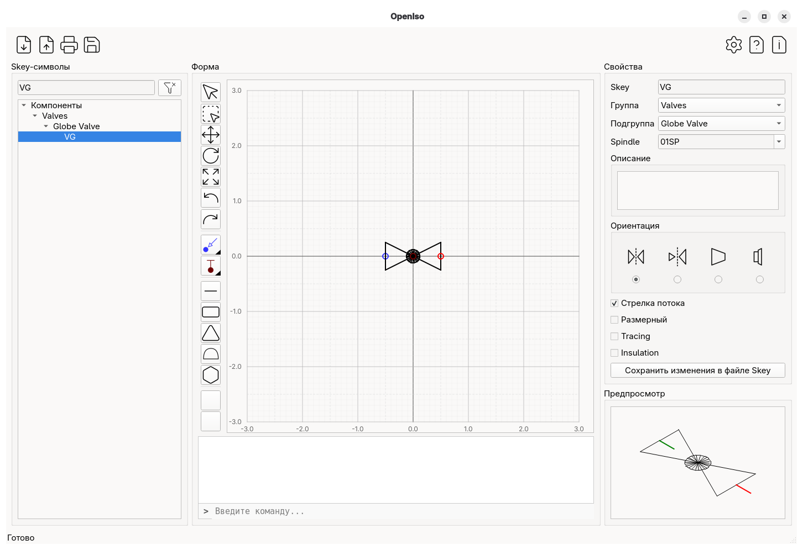
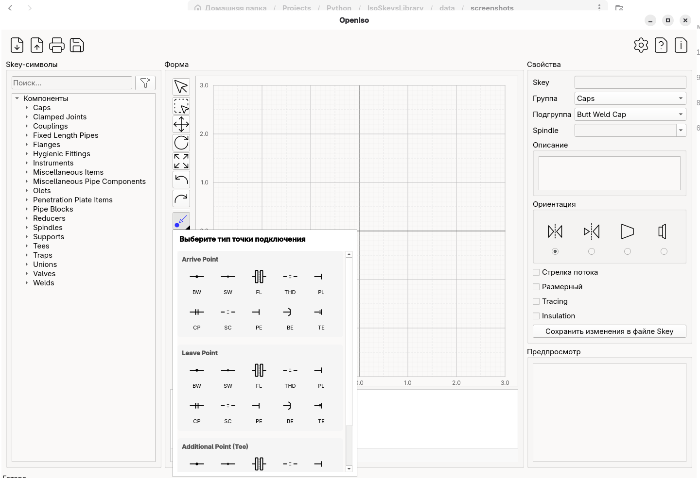
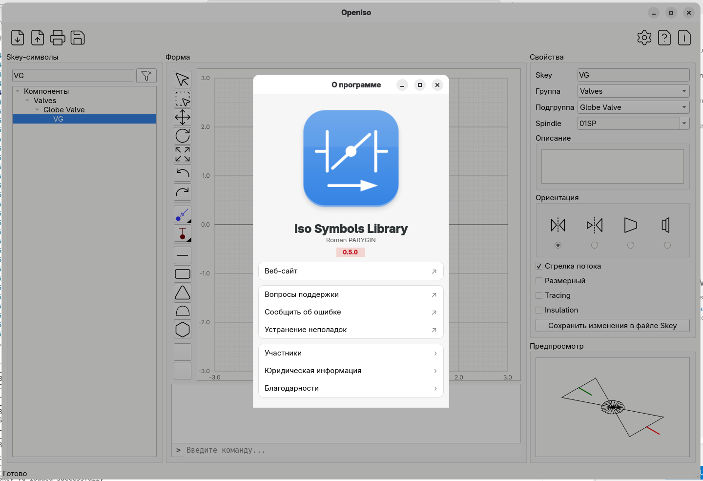

# OpenIso
OpenIso is an open-source, lightweight graphical editor designed specifically for creating and managing piping isometric fitting symbols.  It bridges the gap between manual sketching and complex CAD suites, providing a streamlined environment for designing Symbol Keys (SKEYs) and component graphics used in industrial piping isometrics.

## Screenshots

## Features

- Import symbols from ASCII (Intergraph) and IDF (AVEVA) files
- Visual symbol editor with drawing primitives
- Connection points: Arrive, Leave, Tee, Spindle
- Drawing tools: Line, Rectangle, Triangle, Cap (Arc), Hexagon, Hatching, Color Fill
- Export symbols to JSON
- Internalisation
