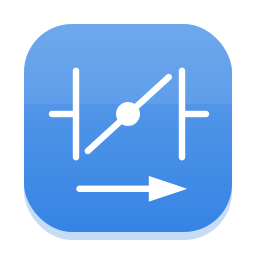
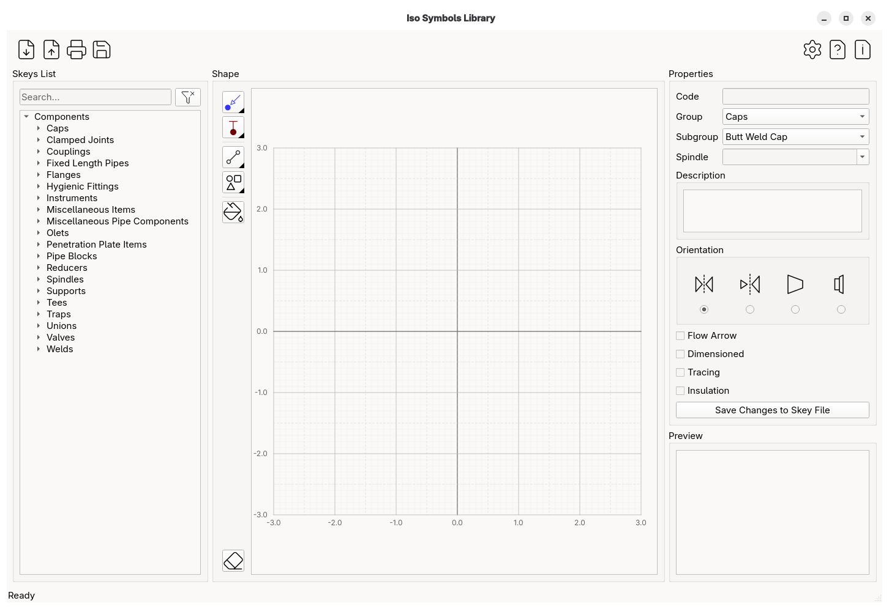
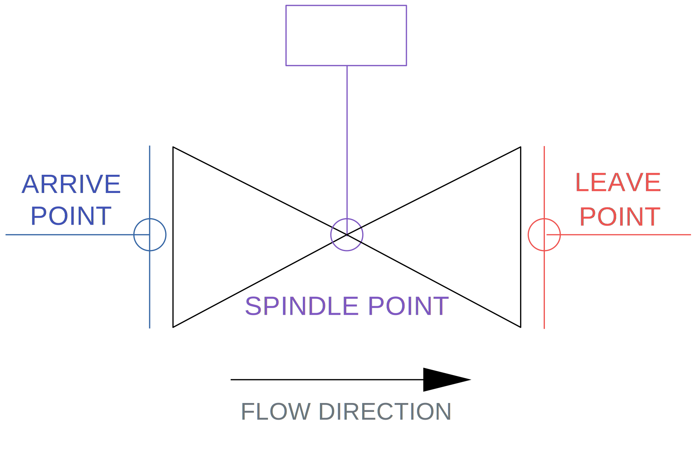

# OpenIso

<p align="center">
  
</p>

<p align="center">
  Lightweight Isometric Piping Symbol Editor.
</p>

---

<p align="center">
  <a href="https://crowdin.com/project/openiso">
    
  </a>
  <a href="https://github.com/rompik/OpenIso/actions/workflows/tests.yml">
    
  </a>
  <a href="https://pypi.org/project/openiso/">
    
  </a>
  <a href="https://github.com/rompik/OpenIso/releases">
    
  </a>
  
  
  <a href="https://opensource.org/licenses/MIT">
    
  </a>
</p>

---

<p align="center">
  
</p>

**OpenIso** is a lightweight, open-source graphical editor designed for creating and managing piping isometric fitting symbols. It bridges the gap between manual sketching and complex CAD suites, providing a streamlined environment for designing **Symbol Keys (Skeys)** and component graphics used in industrial piping software like AVEVA PDMS/E3D or Intergraph Smart 3D.

## Features

* **Format Interoperability:** Import and view symbols from **ASCII (Intergraph)** and **IDF (AVEVA)** files.
* **Precision Connectors:** Define critical piping points: `Arrive`, `Leave`, `Tee`, and `Spindle`.
* **Vector Toolset:** Specialized primitives for skeys:
  * Lines, Rectangles, Rhombus, Circle, Ellipses, Triangles, Caps (Arcs), Hexagons.
  * Hatching and Solid Color Fills.
* **Modern Export:** Save symbols in **ASCII** format for integration with modern piping tools.
* **Globalized:** Full localization support via Crowdin.

---

## Supported Symbol Keys (Skeys)

**OpenIso** allows you to define and edit standard SKEY types used in isometric generation:

| Category | Skey Examples | Description |
| :--- | :--- | :--- |
| **Valves** | `VAVW`, `VAGL`, `VACK` | Gate, Globe, and Check valves |
| **Fittings** | `ELBW`, `TEBW`, `REDC` | Elbows, Tees, and Concentric Reducers |
| **Supports** | `HNGR`, `GUID`, `STOP` | Pipe hangers and supports |
| **Instruments** | `INST`, `FLME` | Inline instruments and Flow meters |
| **Special** | `CAPW`, `FLRF` | Caps and Raised Face Flanges |

---

## Symbol Anatomy

**OpenIso** focuses on the logical structure of a piping component. Each symbol is defined by its geometry and functional connection points.



* **Arrive & Leave:** Define the primary flow path through the component.
* **Spindle:** The orientation point for valve handles or actuators.
* **Tee:** (Not shown) Used for branching components.

---

## Installation (PyPI)

**OpenIso** is distributed via **PyPI**.

Requirements:

* Python 3.10+

Install:

```bash
pip install --upgrade openiso
```

Run:

```bash
openiso
# or
python -m openiso
```

## Development from source (optional)

If you need to work with source code locally:

```bash
git clone https://github.com/rompik/OpenIso.git
cd OpenIso
pip install -e .
python -m openiso
```

---

## Documentation

[:uk: English](./docs/en/INDEX.MD) - Guide to using OpenIso, installation instructions, tutorials, and more.
